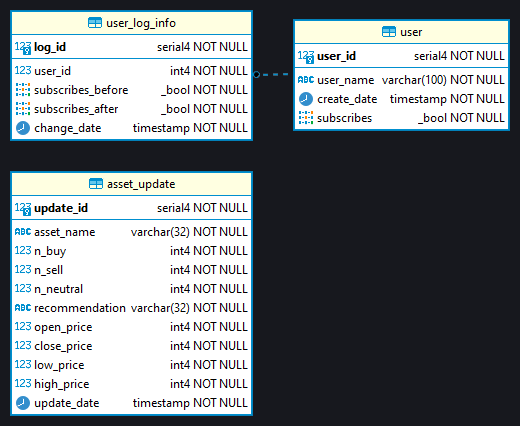

# ExpressReport

## Описание проекта
**ExpressReport** - сигнальный Telegram-бот, собирающий дневные торговые настроения
по активам для предоставления краткой ежедневной рекомендации на покупку или продажу актива.

Тороговые настроения собираются с сайта TradingView - это аналитическая платформа и
социальная сеть, в которой трейдеры могут делится своими мыслями об активах.

По каждому популярному активу ежедневно выкладывается множество рекомендаций от трейдеров следующего вида:​
- положительные (рекомендация к покупке);
- отрицательные (рекомендация к продаже);
- нейтральные (рекомендация не трогать актив).

При наличии статистики рекомендаций можно определить общее настроение рынка по выбранному активу и принять более взвешенное решение при торговле.
С этой целью и был разработан данный проект.​

## Структура проекта

- media
  - **express_report_in_action.gif** - визуализация работы бота
  - **express_report_db_scheme.png** - схема используемой Базы Данных
- src
  - configs
    - **assets_description.py** - набор активов и их описание
    - **config_reader.py** - загрузка секретного Telegram-токена
  - database
    - **db_handlers.py** - обработчики для получения информации из Базы Данных 
    - **db_orm.py** - формирование Базы данных
  - interface
    - keyboards
      - **settings_keyboards.py** - получение интерфейса настроек
      - **start_keyboard.py** - получение основного интерфейса
    - **bot.py** - функционирование Telegram-бота
  - utils
    - **report_preparing.py** - формирование текстового сообщения с отчётом
    - **tradingview_parser.py** - получение данных по активам
- **README.md** - документация проекта
- **requirements.txt** - зависимости проекта

## Функции бота
В рамках использования Telegram-бота пользователь сможет:
1. Подписываться на интересующие активы из имеющегося списка;
2. Изменять выбор интересующих активов;
3. Получать ежедневный отчёт о торговых настроениях по активам, на которые была совершена подписка.
   
## Описание используемой Базы Данных
В рамках проекта была спроектирована База Данных на основе СУБД PostgreSQL.

Физическая схема Базы данных представлена ниже:


Описание таблиц:
1. Таблица **User** - содержит информацию о всех пользователях, которые зарегистировались в нашем боте (написали _/start_).
2. Таблица **User_log_info** - содержит историю изменений подписок пользователя. При изменении пользователем активных подписок поле _User.subscribes_ автоматически обновляется, а предыдущий набор подписок заносится в _User_log_info_.
3. Таблица **Asset_update** - содержит дневную информацию по всем поддерживаемым активам. Добавление информации происходит раз в сутки. 

## Пример работы бота


## Инструкция по локальному запуску бота


### 0. Создать виртуальное окружение и войти в него:

Создание окружения:
```
python3 -m virtualenv .venv
```
Активация окружения (для linux):
```
source .venv/bin/activate
```
Активация окружения (для windows):
```
.venv/Scripts/activate
```
### 1. Загрузить зависимости проекта:
```
pip install -r ./src/requirements.txt 
```

### 2. Спроектировать Базу данных:
```
python3 -m ./src/database/db_orm.py
```
_но перед запуском необходимо раскомментировать 47 строку в db_orm.py для создания БД, если у вас её нет._

### 3. Запустить бота:
```
python3 -m ./src/interface/bot.py
```

## Дальнейшее развитие проекта

Основная часть проекта была успешно реализована, однако есть к чему стремится.

Планы развития проекта:
- [ ] Перенос бота на сервер для постоянного функционирования;
- [ ] Отладка всех ошибок при параллельной обработке запросов;
- [ ] Расширение списка активов за счёт более компактного интерфейса;
- [ ] Добавление выбора времени для присылаемого отчёта;
- [ ] Добавление недельных отчётов по активам.
